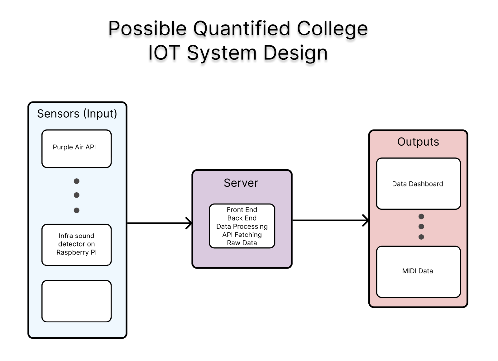

# Quantified-College
FLC Robotics and Folsom Lake College's Data Science Project. Students from the Innovation Center, Robotics Club, and FLC++ collect data from sensors, process it, store it, and to visualize and sonify it. 

## Sensors (Inputs): 
### Active
- Purple Air Weather (https://api.purpleair.com/#api-welcome)
- Buoy 
### Upcoming
- Infrasound 
### Not Started

## Server (Processing Hub): 
- Beelink SEi, CPU: 8279 8GB RAM, 256 GB 
- Windows 11
- Uses Flask 
- possibly using SQlite to store data

## Displays (Outputs):
- Sonification 
- Data Dashboard (URL) 

